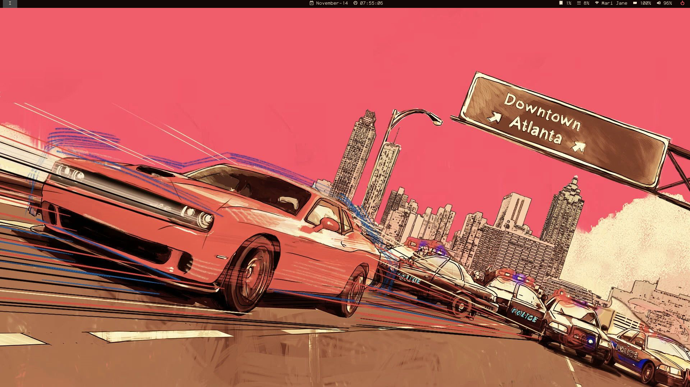
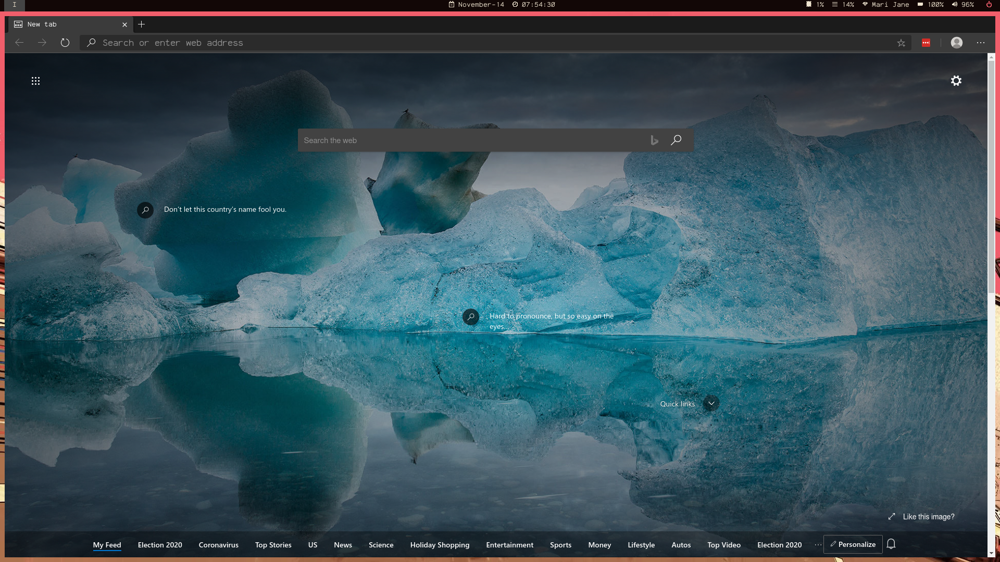
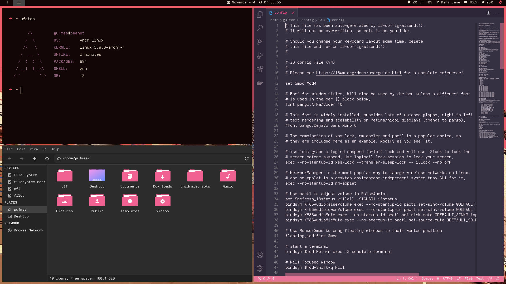

### Unixporn i3-gaps   

## Dependecies
- pywal
- polybar
- kitty terminal
- rofi
- thunar 
- ufetch
- vim and vim-plug
- custom scripts by some posts on reddit =D   

## TODO
- make screen brightness works
- polybar don't startup with system :(
- visual improvements

## Would help me?
Please if you have some hint or suggestion let me know opening an issue.
